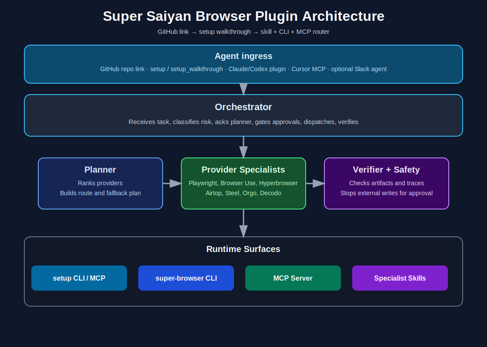

# Super Saiyan Browser

**The agent plugin that picks the right browser backend — then proves the run worked.**

Super Saiyan Browser is a drop-in skill pack, CLI, and MCP server for Claude Code, Codex, Cursor, and any MCP client. Describe a task in natural language; Super Saiyan Browser classifies it, deliberates on provider choice (3–5 loops), routes to the cheapest backend that can do the job, gates risky writes for human approval, and saves artifacts plus a verification report.

**Repo:** [github.com/jbellsolutions/super-saiyan-browser](https://github.com/jbellsolutions/super-saiyan-browser)

---

## Drop this link to your agent

Copy-paste this as the first message after sharing the repo:

> Install Super Saiyan Browser from `https://github.com/jbellsolutions/super-saiyan-browser`. Run `./scripts/super-browser setup --client cursor` (or `codex` / `claude`). Follow every step — skills, MCP, `.env` keys, doctor. Use **super-browser-orchestrator** for all browser/computer tasks. **Plan** before **run**. Do not execute until `deliberation_complete` is true. Stop for approval on external writes. Never paste API keys into chat — use `.env` locally.

Machine-readable equivalent:

```bash
./scripts/super-browser setup --client cursor
```

MCP: call `setup_walkthrough` — same welcome text and numbered steps.

---

## Hey, here's how this works

You (or your agent) get a **browser/computer job** in plain English — extract a page, log into a dashboard, scrape behind anti-bot, post a comment, or fetch a JSON API. Super Saiyan Browser does not make you pick Hyperbrowser vs Steel vs Playwright up front.

1. **Plan** — `./scripts/super-browser setup` on first use, then `plan` (or MCP `plan_browser_task`). The planner runs **3 deliberation loops** for simple jobs and **5** when multiple cloud providers could work. You get a `council_report` with provider order, cost estimate, and `deliberation_complete`.
2. **Approve** — Posts, DMs, purchases, CRM changes, and credential-bearing work stop at `awaiting_approval` until a human approves with a reason. Draft-only tasks that explicitly say *do not publish* can proceed without approval.
3. **Execute** — Primary provider runs first; fallbacks try the next option if needed. Artifacts land under `.super-browser/`.
4. **Verify** — `verify` checks run reports, policy guards, and artifact integrity before anyone claims success.

---

## Start here (60 seconds)

```bash
git clone https://github.com/jbellsolutions/super-saiyan-browser.git && cd super-saiyan-browser
./scripts/super-browser setup --client cursor
cp .env.example .env                   # add API keys locally — never commit .env
pip install -e ".[playwright,mcp]" && playwright install chromium
export SUPER_BROWSER_REPO_ROOT="$(pwd)"
./scripts/super-browser install-skill --target ~/.cursor/skills --force
./scripts/super-browser init-mcp --path ~/.cursor/mcp.json --merge --cwd "$(pwd)"
./scripts/super-browser doctor
```

Human walkthrough: [docs/setup-walkthrough.md](docs/setup-walkthrough.md) · Agent cheat sheet: [docs/agent-quickstart.md](docs/agent-quickstart.md)

---

## Optional: Chrome extension (no server)

Scrape paginated lists in your logged-in Chrome tab and export CSV — no Railway, API URL, or token.

1. `chrome://extensions` → Developer mode → **Load unpacked** → select `extension/`
2. Open a results page (directory, community members, etc.)
3. Side panel → **Detect table** → **Run scrape** → **Export CSV**

Guide: [docs/chrome-extension.md](docs/chrome-extension.md)

Cloud API hosting is advanced and optional; the client extension works without it.

---

## Optional: provider keys

Local Playwright and raw HTTP work without paid keys. Add only what you need:

```bash
cp .env.example .env
./scripts/super-browser env-checklist
```

| Provider | Env var | Sign up |
| --- | --- | --- |
| Browser Use | `BROWSER_USE_API_KEY` | [cloud.browser-use.com](https://cloud.browser-use.com/) |
| Bright Data | `BRIGHTDATA_API_KEY` + zones | [brightdata.com](https://brightdata.com/) — run `super-browser brightdata-discover --write-env` |
| Hyperbrowser | `HYPERBROWSER_API_KEY` | [hyperbrowser.ai](https://www.hyperbrowser.ai/) |
| Airtop | `AIRTOP_API_KEY` | [airtop.ai](https://www.airtop.ai/) |
| Steel | `STEEL_API_KEY` | [steel.dev](https://steel.dev/) |
| Orgo | `ORGO_API_KEY` | [orgo.ai](https://orgo.ai/) |

Full table: [docs/setup-walkthrough.md#step-5--get-api-keys-signup-links](docs/setup-walkthrough.md)

---

## What you get

| Piece | What it does |
| --- | --- |
| **Orchestrator + specialist skills** | Classify tasks, deliberate on providers, gate publishing, verify results |
| **`super-browser` CLI** | Plan, run, approve, resume, verify — JSON in/out for scripts |
| **MCP server** | Same runtime as tools (`setup_walkthrough`, `plan_browser_task`, `run_browser_task`, …) |
| **Chrome extension** | In-tab paginated list scrape + CSV export |
| **Codex / Claude plugins** | `.codex-plugin/` and `.claude-plugin/` bundle skills + MCP |
| **Durable runs** | SQLite store, artifacts, `run-report.json`, handoff for another agent |



---

## Supported providers (current lineup)

Capability picks the provider; **rank** is only the cost tie-breaker when several can do the job.

| Rank | Provider | Best for | Adapter |
| --- | --- | --- | --- |
| **SERP lane** | **Bright Data SERP** | Google/Bing/Yandex search results, dorks | live |
| **1** | **Playwright** (local) | Deterministic tests, screenshots, cheap extraction | live |
| **1** | **Browser Use** | Anti-bot, profiles, hardened cloud Chromium | live |
| **1** | **Bright Data Unlocker** | One-shot anti-bot URL unlock (markdown/HTML) | live |
| **1** | **Bright Data Dataset** | Structured LinkedIn/Facebook/Maps extractors | live |
| **2** | **Bright Data Browser** | JS-heavy / interactive scraping browser (CDP) | live |
| **2** | **Hyperbrowser** | Cloud scrape jobs, geo proxy, scale automation | live |
| **2** | **Airtop** | Cloud sessions, page-query, GTM / webhook workflows | live |
| **2** | **Browserbase** | Stagehand, Model Gateway BYOK, hosted agents | **docs-only** ([audit](references/providers/browserbase-capability-audit.md)) |
| **3** | **Steel** | Hosted Chromium via Playwright CDP | live |
| **4** | **Orgo** | Full desktop — files, terminal, multi-window | live |
| **Lane** | **Decodo HTTP** | Raw `http(s)://` endpoints + optional residential proxy | live |

Per-provider SSOT: [references/providers/](references/providers/) · Routing: [references/routing-playbook.md](references/routing-playbook.md)

---

## Example commands

```bash
super-browser plan --goal "Extract product names from https://example.com"
super-browser serp --query "commercial cleaning companies Texas"
super-browser hunt --niche "local HVAC companies" --dry-run
super-browser run --goal "Draft a LinkedIn comment but do not publish"
super-browser approve <run-id> --by "you" --reason "approved exact text" --execute
super-browser verify <run-id>
```

---

## MCP tools (high level)

`setup_walkthrough` · `plan_browser_task` · `run_browser_task` · `verify_browser_run` · `browser_doctor` · `env_checklist` · `install_super_browser_skill` · `init_super_browser_mcp`

`setup_walkthrough` returns a `welcome` string plus numbered steps — use it as the first message when someone drops this repo link into an agent.

---

## Production checklist

```bash
./scripts/verify-super-browser
super-browser production-readiness
super-browser env-checklist
super-browser live-test --provider all   # needs API keys in .env
```

---

## Install options

| Client | Path |
| --- | --- |
| **Cursor** | `install-skill` + `init-mcp --merge` |
| **Codex** | `.codex-plugin/plugin.json` — set `SUPER_BROWSER_REPO_ROOT` |
| **Claude Code** | `.claude-plugin/plugin.json` — same env var |
| **Python only** | `pip install -e .` or `pip install -e ".[all-providers]"` |

---

## Docs map

| Doc | Use when |
| --- | --- |
| [setup-walkthrough.md](docs/setup-walkthrough.md) | Onboarding humans or agents step by step |
| [agent-quickstart.md](docs/agent-quickstart.md) | Drop-in GitHub link for another agent |
| [chrome-extension.md](docs/chrome-extension.md) | Load unpacked extension + list scraping |
| [provider-matrix.md](references/provider-matrix.md) | Provider capabilities and env vars |
| [security-and-approval-policy.md](references/security-and-approval-policy.md) | Approval, target scope, redaction |

---

## Development

```bash
python3 -m pip install -e .
python3 -m unittest discover -s tests
./scripts/verify-super-browser
```

Run store defaults to `.super-browser/` (override with `SUPER_BROWSER_STATE_DIR`).

---

MIT · [AI Integraterz](https://github.com/jbellsolutions)
